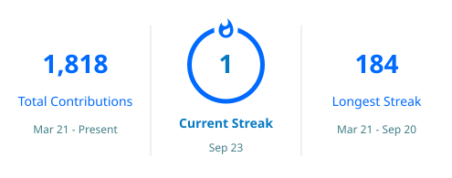

<h1 align="center">Hi 👋, I'm Ishant Bhurani</h1>
<h3 align="center">Full-Stack Developer • Building scalable web applications</h3>

  

---

## 👨‍💻 About Me

- 🚀 Passionate about **Full-Stack Development**
- 💻 I enjoy building modern web applications with scalable architectures
- 🌱 Currently exploring advanced backend systems and cloud technologies
- 📫 Reach me at **ishant.dev@outlook.com**

---

## 🌐 Connect with Me

  
  &nbsp;&nbsp;
  

---

## 🛠️ Languages & Tools

---

## 📊 GitHub Stats

  
  <!--  -->

